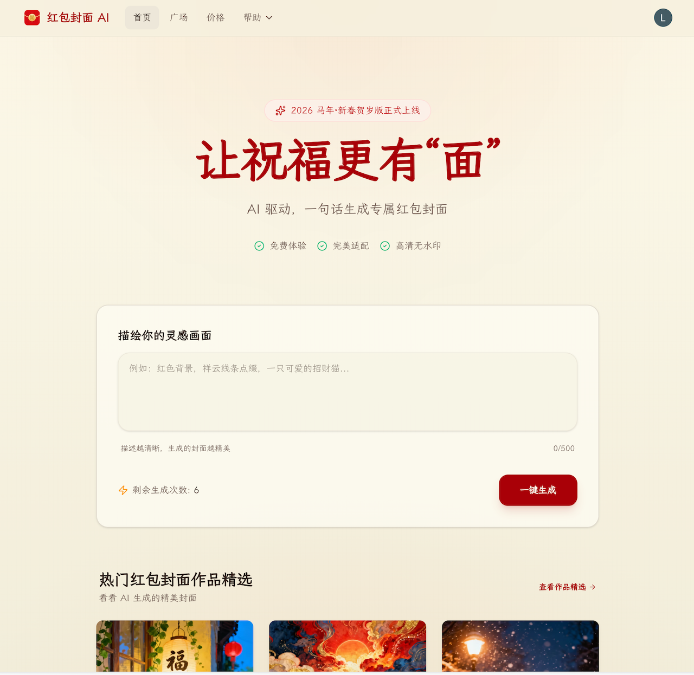
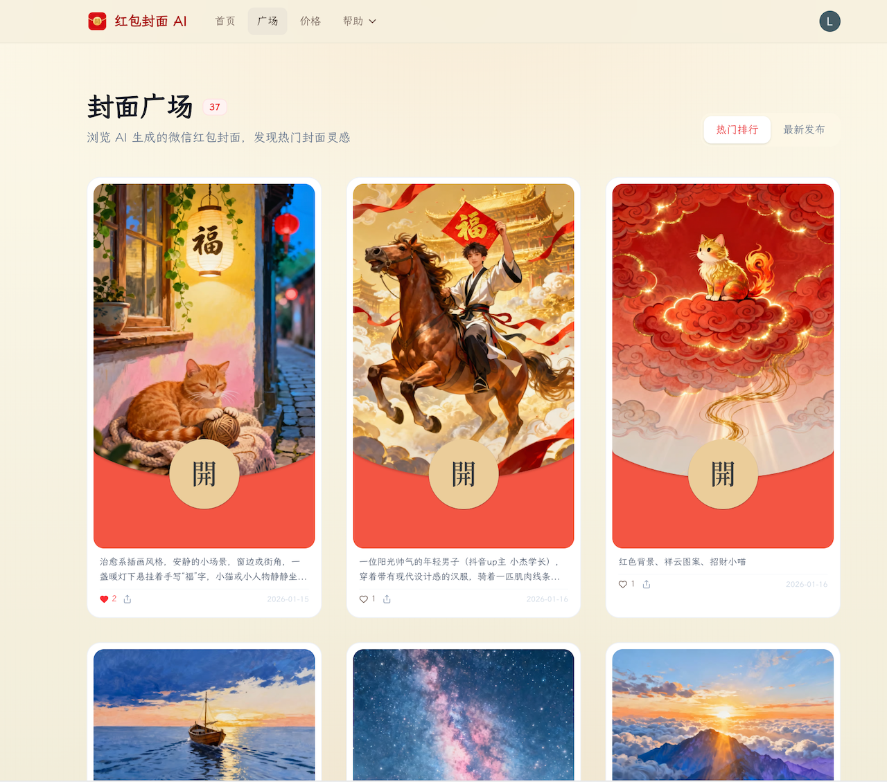
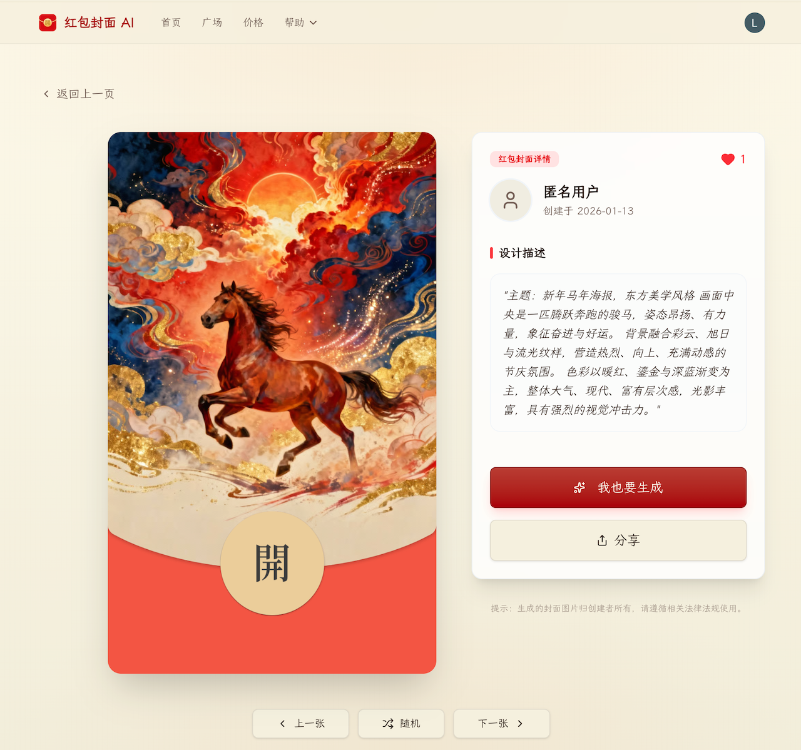
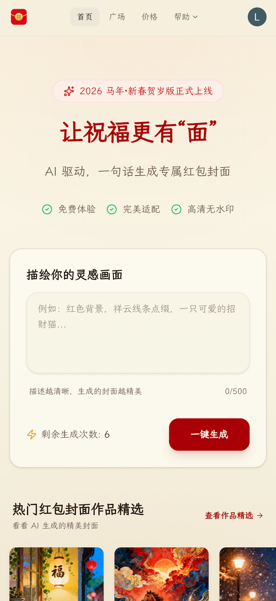
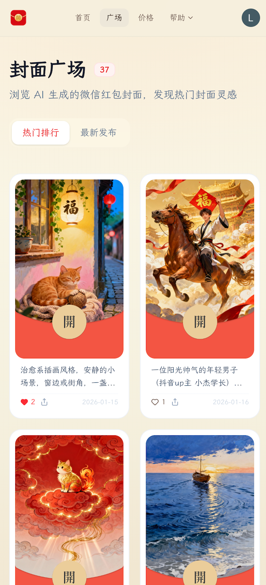
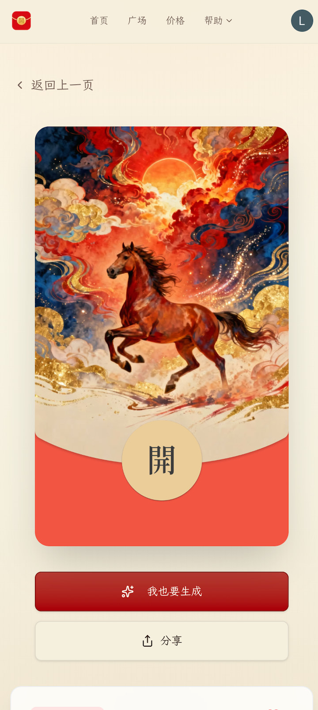

<p align="center">
  
</p>

<h1 align="center">Hongbao AI</h1>

<p align="center">
  <strong>AI-powered WeChat Red Envelope Cover Generator</strong>
</p>

<p align="center">
  Generate unique, personalized WeChat red envelope covers with AI in seconds.
</p>

<p align="center">
  <a href="https://hongbao.elvinn.wiki">Live Demo</a> •
  <a href="README_CN.md">中文文档</a> •
  <a href="#features">Features</a> •
  <a href="#quick-start">Quick Start</a>
</p>

<p align="center">
  
  
  
  
</p>

<p align="center">
  <a href="https://hongbao.elvinn.wiki">
    
  </a>
</p>

---

## What is Hongbao AI?

**Hongbao AI** (红包封面 AI) is an AI-powered web application that generates custom WeChat red envelope covers. Simply describe what you want in natural language, and AI will create a beautiful, high-quality cover image that meets WeChat's official specifications.

Perfect for Chinese New Year, birthdays, weddings, or any special occasion where you want to send unique red envelopes!

## Screenshots

Fully responsive design supporting both **Desktop** and **Mobile** devices.

### Desktop

| Home | Gallery | Cover Detail |
|:----:|:-------:|:------------:|
|  |  |  |

### Mobile

| Home | Gallery | Cover Detail |
|:----:|:-------:|:------------:|
|  |  |  |

## Features

- 🎨 **AI Image Generation** - Describe your ideal cover and let AI create it
- 📐 **WeChat Compliant** - Output perfectly sized for WeChat red envelope covers
- ⚡ **Fast Generation** - Get your cover in seconds with Volcano Engine's Seeddream model
- 🖼️ **High Quality** - HD images without watermarks (premium)
- 💳 **Flexible Pricing** - Free tier available, premium plans for more features
- 🌐 **Modern Stack** - Built with Next.js 16, TypeScript, and Tailwind CSS
- 🔐 **Secure Auth** - Authentication powered by Clerk
- 💾 **Cloud Storage** - Images stored on Cloudflare R2 with CDN delivery

## Tech Stack

| Category | Technology |
|----------|------------|
| Framework | [Next.js 16](https://nextjs.org/) (App Router) |
| Language | [TypeScript 5](https://www.typescriptlang.org/) |
| Styling | [Tailwind CSS 4](https://tailwindcss.com/) + [shadcn/ui](https://ui.shadcn.com/) |
| Database | [Supabase](https://supabase.com/) (PostgreSQL) |
| Auth | [Clerk](https://clerk.com/) |
| AI | [Volcano Engine Seeddream](https://www.volcengine.com/) |
| Storage | [Cloudflare R2](https://www.cloudflare.com/r2/) |
| Payments | [Stripe](https://stripe.com/) |
| Rate Limiting | [Upstash Redis](https://upstash.com/) |

## Quick Start

### Prerequisites

- Node.js >= 18.17.0
- pnpm 10+
- Accounts for: Supabase, Clerk, Volcano Engine, Cloudflare R2, Stripe, Upstash

### Installation

1. **Clone the repository**

```bash
git clone https://github.com/nicekate/hongbao.git
cd hongbao
```

2. **Install dependencies**

```bash
pnpm install
```

3. **Set up environment variables**

```bash
cp .env.example .env.local
```

Edit `.env.local` with your credentials (see [Environment Variables](#environment-variables) below).

4. **Set up the database**

Run the SQL schema in your Supabase project:

```bash
# Copy contents from design/database/schema.sql
# Paste and run in Supabase SQL Editor
```

5. **Start the development server**

```bash
pnpm dev
```

Open [http://localhost:3000](http://localhost:3000) to see the app.

## Environment Variables

Copy `.env.example` to `.env.local` and fill in your values:

### Required Variables

| Variable | Description | Where to Get |
|----------|-------------|--------------|
| `NEXT_PUBLIC_SITE_URL` | Your production URL | Your domain |
| `ARK_API_KEY` | Volcano Engine Ark API key | [Volcano Engine Console](https://console.volcengine.com/ark) |
| `NEXT_PUBLIC_SUPABASE_URL` | Supabase project URL | [Supabase Dashboard](https://app.supabase.com/) |
| `NEXT_PUBLIC_SUPABASE_ANON_KEY` | Supabase anon/public key | Supabase Dashboard > Settings > API |
| `SUPABASE_SERVICE_ROLE_KEY` | Supabase service role key | Supabase Dashboard > Settings > API |
| `R2_ACCOUNT_ID` | Cloudflare account ID | [Cloudflare Dashboard](https://dash.cloudflare.com/) |
| `R2_ACCESS_KEY_ID` | R2 API access key | Cloudflare Dashboard > R2 > Manage R2 API Tokens |
| `R2_SECRET_ACCESS_KEY` | R2 API secret key | Same as above |
| `R2_BUCKET_NAME` | R2 bucket name | Your R2 bucket |
| `R2_CDN_DOMAIN` | CDN domain for images | Your Cloudflare CDN domain |
| `NEXT_PUBLIC_CLERK_PUBLISHABLE_KEY` | Clerk publishable key | [Clerk Dashboard](https://dashboard.clerk.com/) |
| `CLERK_SECRET_KEY` | Clerk secret key | Clerk Dashboard |
| `STRIPE_SECRET_KEY` | Stripe secret key | [Stripe Dashboard](https://dashboard.stripe.com/apikeys) |
| `STRIPE_WEBHOOK_SECRET` | Stripe webhook secret | Stripe Dashboard > Webhooks |
| `UPSTASH_REDIS_REST_URL` | Upstash Redis URL | [Upstash Console](https://console.upstash.com/) |
| `UPSTASH_REDIS_REST_TOKEN` | Upstash Redis token | Upstash Console |

### Optional Variables

| Variable | Description | Default |
|----------|-------------|---------|
| `SEEDDREAM_MODEL` | AI model name | `doubao-seedream-4-0-250828` |
| `IMAGE_GENERATION_SYSTEM_PROMPT` | Custom AI prompt | Built-in prompt |

## Database Setup

This project uses Supabase (PostgreSQL) for data storage. The schema includes:

- `users` - User information and credits
- `generation_tasks` - Image generation task tracking
- `images` - Generated image metadata
- `image_likes` - User likes on images
- `payments` - Payment records

To set up the database:

1. Create a new Supabase project
2. Go to SQL Editor
3. Copy and run the contents of `design/database/schema.sql`

## Available Scripts

| Command | Description |
|---------|-------------|
| `pnpm dev` | Start development server |
| `pnpm build` | Build for production |
| `pnpm start` | Start production server |
| `pnpm lint` | Run ESLint |
| `pnpm lint-fix` | Run ESLint with auto-fix |
| `pnpm format` | Format code with Prettier |
| `pnpm type-check` | Run TypeScript type checking |
| `pnpm test` | Run tests with watch mode |
| `pnpm test:ci` | Run tests once (CI mode) |

## Deployment

### Vercel (Recommended)

1. Push your code to GitHub
2. Import the project in [Vercel](https://vercel.com/)
3. Add all environment variables in Vercel project settings
4. Deploy

### Other Platforms

The app can be deployed to any platform that supports Next.js:

- [Netlify](https://netlify.com/)
- [Railway](https://railway.app/)
- [Render](https://render.com/)
- Self-hosted with Docker

## Project Structure

```
src/
├── app/                 # Next.js App Router pages
│   ├── api/            # API routes
│   ├── cover/          # Cover detail page
│   ├── gallery/        # Public gallery
│   ├── my-gallery/     # User's gallery
│   ├── pricing/        # Pricing page
│   └── ...
├── components/         # React components
│   └── ui/            # shadcn/ui components
├── config/            # App configuration
├── hooks/             # Custom React hooks
├── providers/         # React context providers
├── services/          # Business logic services
├── supabase/          # Supabase client utilities
├── types/             # TypeScript types
└── utils/             # Utility functions
```

## Contributing

Contributions are welcome! Please feel free to submit a Pull Request.

1. Fork the repository
2. Create your feature branch (`git checkout -b feature/amazing-feature`)
3. Commit your changes (`git commit -m 'feat: add amazing feature'`)
4. Push to the branch (`git push origin feature/amazing-feature`)
5. Open a Pull Request

Please follow the [Conventional Commits](https://www.conventionalcommits.org/) specification for commit messages.

## License

This project is licensed under the MIT License - see the [LICENSE](LICENSE) file for details.

## Acknowledgments

- [Volcano Engine](https://www.volcengine.com/) for the Seeddream AI model
- [AI Cover](https://github.com/all-in-aigc/aicover) for the inspiration of AI-generated red envelope covers
